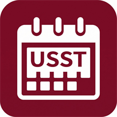

# USST 教务系统 Android 原生客户端 (usst-jwgl-client)

  

  <b>优雅 · 现代 · 安全 · 高效</b> 
  基于 Material Design 3 设计的上海理工大学教务系统 Android 原生客户端，专为上理学子打造。

---

## 🌟 核心特性

### 📅 智能课表系统
- **时刻表双轨支持**：
  - 自动识别新老学期制度，2025-2026-2 及以往历史学期采用 **12节老时刻表**，2026-2027-1 起采用 **13节新时刻表**。
  - 自动云端拉取学期与放假调休信息，避免因教学安排变动带来的错提醒和漏提醒。
  - 左侧时刻栏同时清晰呈现每小节课程的**上课与下课准确时间**。
  - 支持可选的**时段视觉分隔元素**（上午 / 下午 / 晚上）。
- **全学期周次视图**：
  - 顶部胶囊一键调起周次选择弹窗，当前周次高亮标记，日期（月/日）动态匹配。
  - 支持“仅本周课程”单选过滤，支持多周次/单双周排课课程合并与冲突检测。
  - 课程详情卡片展示课程代码、学分、考核方式（考试/考查）、教学班号及授课教师。
- **自定义排课与调度**：
  - 支持自定义新增课程并智能校验节次冲突。
  - 支持**本周单次停课**、**单时段删除**与**整门课程移除**。
  - 课表底部轻量留白展示作者信息，不遮挡末节课程。

### 📝 考试日程与倒计时
- 课表顶栏内置**考试查询**快捷入口，直接向教务系统请求期末、期中、缓考及补考详细日程。
- 考试周自动排布为三场次标准时间（09:00-11:00 / 13:00-15:00 / 15:30-17:30）。
- 考试前自动进行本地定时提醒。

### ⏰ 精准通知提醒
- **课前 / 考前双重独立提醒**：
  - 基于 Android 系统底层 AlarmManager 精准定时唤醒，**无需后台常驻进程，零耗电**。
  - 提醒提前量自由可调（课前可设 5\~30 分钟，考前可设 15\~120 分钟）。
  - 支持设备重启自动重新注册闹钟（已获安全权限保护）。

### 📊 学业情况与成绩档案
- **学业情况总览**：
  - 支持全部学期与分学期动态筛选，实时核算加权平均分与平均学分绩点 (GPA)。
  - 成绩等级标签视觉化（优秀、良好、通过、挂科等）。
- **学业证明与成绩单离线生成与下载**：
  - 支持生成并导出中文/英文加权平均分证明、排名证明 PDF 文档。
  - 支持一键调起系统应用查看或分享生成的正式 PDF。

### 🌐 官方教务系统免密直达
- 个人与设置中内置 **更多功能 · 进入官方教务系统网页版**。
- App 自动将当前登录的 CAS SSO 会话凭据无缝注入原生 WebView，实现**免输账号密码秒进教务系统后台**。
- 支持网页内后退、页面前进与标题自适应。

---

## 🔒 安全性与隐私合规

本项目经过深度安全加固，守护学生隐私与凭据安全：

| 安全项 | 实现方式 |
| :--- | :--- |
| **密码存储** | 采用 Google Jetpack EncryptedSharedPreferences + Android Keystore 硬件级 AES-256 加密，杜绝明文凭据泄露。 |
| **网络通信** | 全面禁止明文 HTTP 流量，严格配置network_security_config.xml，仅信任官方 HTTPS 通信。 |
| **防数据备份泄露** | 禁用 allowBackup，配置 data_extraction_rules.xml，排除一切缓存与本地 SQLite 数据库被外部提取。 |
| **广播导出防护** | 开机重启 Receiver 绑定 RECEIVE_BOOT_COMPLETED 系统级权限，阻止第三方 App 恶意唤起。 |
| **存储暴露收窄** | FileProvider 路径严格收缩在私有下载目录，杜绝全目录遍历风险。 |
| **隐私承诺** | **本 App 为非官方开源项目，仅供开发学习，不上传任何数据，不泄露任何隐私。所有数据均保存在用户手机本地。** |

---

## ⚡ 性能优化

- **SQLite 批量事务包裹**：课表与时段初始化批量操作全部包裹在单次 db.beginTransaction() 事务中，减少磁盘 fsync，冷启动性能提升 5~10 倍。
- **UI 主线程零阻塞**：所有数据库读写、周次计算与网络会话解析均运行于 Kotlin Coroutine Dispatchers.IO。
- **R8 极致瘦身与混淆**：开启 Release 构建 R8 混淆、无用代码剥离与未引用资源缩减，安装包体积由 9.4MB 锐减至 **2.7MB**。
- **增量构建支持**：开启 Gradle 并行编译与构建缓存。

---

## 🛠️ 技术栈

- **开发语言**：Kotlin 2.0+
- **目标平台**：Android 7.0+ (API Level 24 ~ 36)
- **UI 框架**：Material Design 3 (Material Components for Android) + ViewBinding
- **架构组件**：Lifecycle, Coroutines, Navigation, Splashscreen
- **网络与解析**：OkHttp 4.12, Jsoup 1.17, Gson 2.10
- **安全组件**：AndroidX Security Crypto (AES-256 SIV/GCM)
- **PDF 处理**：Android 原生 PdfDocument 渲染引擎

---

## 📥 下载与安装

请前往 [Releases 页面](https://github.com/BigSilverFish/usst-jwgl-client/releases) 下载最新发布的 Release APK：

- **最新稳定版**：[v1.0.0 Release](https://github.com/BigSilverFish/usst-jwgl-client/releases/tag/v1.0.0)
- **安装要求**：Android 7.0 (API 24) 及以上版本的安卓手机。

---

## 👨‍💻 作者与开源声明

- **作者**：[GitHub@BigSilverFish](https://github.com/BigSilverFish)
- **开源许可证**：本项目代码基于开源学习目的分享，遵循项目根目录下协议。
- **免责声明**：本 App 非上海理工大学官方出品，所有教务数据均来自学校官方教务系统公开接口。请妥善保管个人学号及密码。
